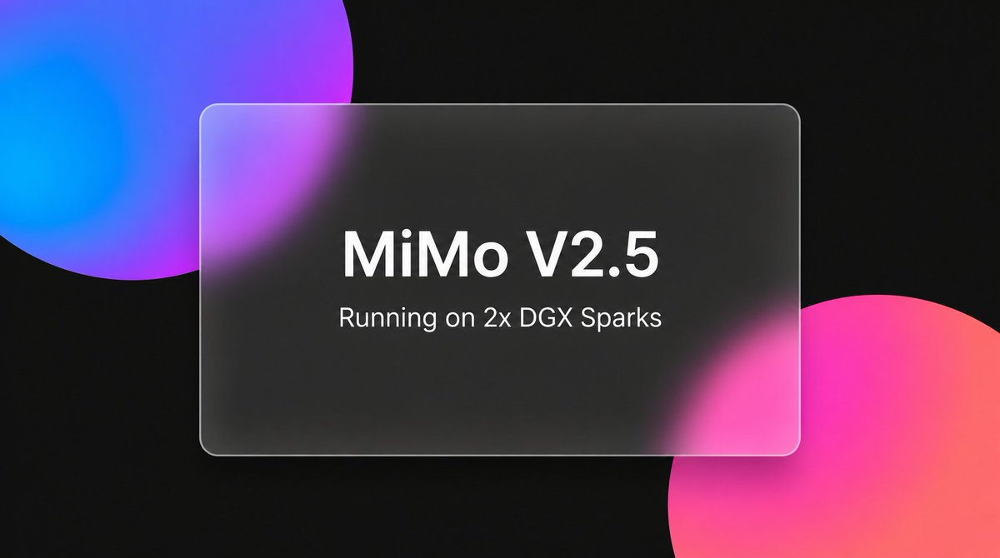

# MiMo-V2.5 Omni · NVFP4 KV · TP=2 · 2× DGX Spark

<p align="center">
  
</p>

**Mia's MiMo-V2.5 Dual DGX Spark Start Script** — serve **MiMo-V2.5 Omni** (`MiMoV2OmniForCausalLM` + **MTP1**) with **4-bit NVFP4 KV** tensor-parallel across **two NVIDIA DGX Spark (GB10)** boxes with Ray, on port **8888**.

<p>
<a href="https://x.com/MiaAI_lab" target="_blank">
  
</a>
</p>
<p>
<a href='https://ko-fi.com/Z8Z3SPLOD' target='_blank'></a>
</p>


Repo: [MiaAI-Lab/MiMo-V2.5-vLLM-Dual-DGX-Sparks](https://github.com/MiaAI-Lab/MiMo-V2.5-vLLM-Dual-DGX-Sparks)

This tree is **Omni only** — no DFlash lane.

| | |
|---|---|
| **Context** | `max_model_len = 1_000_000` |
| **Concurrency** | `max_num_seqs = 3` |
| **KV cache** | `nvfp4` via `triton_attn_diffkv` |
| **Parallelism** | TP=2, PP=1 · Ray cross-node |
| **Spec decode** | MTP1 (`num_speculative_tokens=1`) |
| **Modalities** | text + image + video + audio (`limit-mm-per-prompt`) |
| **API** | OpenAI-compatible · `http://<head>:8888/v1` |
| **Served name** | `MiMo-V2.5-NVFP4` |

---

## KV cache · 1M context · 3 concurrent

`max_num_seqs=3` and `max_model_len=1M` do **not** reserve 3×1M in VRAM. The engine shares one KV token pool across live requests.

Measured at boot on this 2× Spark pair (Omni MTP1 @ GMU **0.83**, `max_model_len=1_000_000`, `max_num_seqs=3`):

| Log line | Value |
|---|---|
| Available KV cache memory (head / worker) | **15.2 GiB** / **8.35 GiB** |
| **GPU KV cache size** (engine pool) | **2,704,932 tokens** |
| Implied concurrency @ 1M / request | **~2.70×** |

```text
3 × 1,000,000 = 3,000,000 tokens needed for three full-1M streams
pool          = 2,704,932 tokens available
→ only ~2 full-1M streams fit; a 3rd deep 1M waits (queues) until KV frees
```

Practical reading:

- **2 agents at full 1M** — fits.  
- **3 agents at full 1M** — third scheduled but **blocked/queued** on KV.  
- **3 agents at moderate depth** — all run if total KV ≤ ~2.70M.  

Confirm live numbers in `vllm.log` after launch:

```text
Available KV cache memory: …
GPU KV cache size: 2,704,932 tokens
Maximum concurrency for 1,000,000 tokens per request: 2.70x
```

---

## Performance (this pair · 2026-07-14)

Token speed bench (`tok.sh`) against `http://localhost:8888/v1/chat/completions` after Omni MTP1 bring-up.

| Setting | Value |
|---|---|
| Max tokens | 1500 |
| Temperature / top_p | 0.0 / 1.0 |
| Concurrency | 1, 2, 3 (= `max_num_seqs`) |
| Runs per level | equal to concurrency |
| Shape | GMU **0.83** · MTP1 · NVFP4-KV · `enforce_eager` |

### Comparison (`tok.sh`)

Per-run **mean Gen / E2E tok/s** (what the tool prints), plus **cumulative tok/s** = total tokens ÷ wall clock for that concurrency level:

| Conc | Runs | Gen tok/s | E2E tok/s | Wall (s) | Tokens | Cumulative tok/s |
|---:|---:|---:|---:|---:|---:|---:|
| **1** | 1 | **30.00** | **31.09** | 26.63 | 828 | **31.09** |
| 2 | 2 | 25.77 | 26.71 | 47.73 | 1,989 | **41.67** |
| 3 | 3 | 21.85 | 22.53 | 60.53 | 3,398 | **56.14** |

Best single-stream: **30.00 gen tok/s** / **31.09 E2E**. Peak shared throughput on this shape: **~56 tok/s cumulative @ C3**. Tony’s published Omni MTP1 reference (GMU 0.84 / seqs=8) is ~**31.9–32.1** single-stream.

---

## Hardware

| Role | Example | Fabric |
|---|---|---|
| Head (rank 0) | `10.0.0.1` | RoCE `enp1s0f1np1` / HCA `rocep1s0f1` · GID 3 |
| Worker (rank 1) | `10.0.0.2` | same |

- Docker + NVIDIA Container Toolkit on **both** nodes  
- Passwordless SSH from head → worker  
- Weights readable on both nodes (local HF hub preferred)


---

## Quick start

From the **head** node:

```bash
cd /mnt/models/MiMo

# Optional overrides
# export HEAD_IP=10.0.0.1 WORKER_IP=10.0.0.2 SSH_USER=zurih
# export MAX_MODEL_LEN=1000000 MAX_NUM_SEQS=3 GPU_MEMORY_UTILIZATION=0.83

bash start.sh          # download/sync weights if needed → containers → Ray → Omni → chat verify
bash stop.sh           # stop vLLM + Ray + containers (containers left stopped, not removed)
```

Useful modes:

```bash
bash start.sh --check      # print plan + weight completeness (no download / no launch)
bash start.sh --teardown   # force tear down cluster
bash stop.sh --check       # dry-run stop
```

Exit **0** from `start.sh` only after a real `/v1/chat/completions` returns non-empty content.  
Always `bash start.sh` — never `source start.sh` (sourcing runs `main`).

### Smoke

```bash
curl http://127.0.0.1:8888/v1/models | jq .

curl http://127.0.0.1:8888/v1/chat/completions \
  -H 'Content-Type: application/json' \
  -d '{
    "model": "MiMo-V2.5-NVFP4",
    "messages": [{"role":"user","content":"Reply with just: ok"}],
    "max_tokens": 16,
    "temperature": 0,
    "chat_template_kwargs": {"enable_thinking": false}
  }'
```

---

## Agent clients (OMP / OpenAI-compatible)

Served model id: **`MiMo-V2.5-NVFP4`** (`MiMoV2OmniForCausalLM`).  
Point agents at `http://<head>:8888/v1` (or `http://localhost:8888/v1` on the head).

### Omni multimodal (required in client config)

This is a **full Omni** endpoint — not text-only. Advertise all four input modalities:

```yaml
input: [text, image, video, audio]
```

Server per-prompt caps (`launch-omni.sh`):

| Modality | Max per prompt |
|---|---:|
| image | **4** |
| video | **1** |
| audio | **1** |

(`--limit-mm-per-prompt '{"image":4,"video":1,"audio":1}'` · `--mm-encoder-tp-mode data`)

If OMP/UI only lists text+image, the model entry is wrong — keep **video** and **audio** in `input:`.

### Recommended request params

| Param | Value | Why |
|---|---|---|
| `temperature` | `0` | Stable tool / agent runs |
| `top_p` | `0.95` | Matches server generation defaults |
| `repetition_penalty` | `1.08` | Stability default; use `1.0` only when chasing tok/s |
| `chat_template_kwargs.enable_thinking` | `false` | Thinking-off for agents / structured work |
| `max_tokens` | ≤ `32768` | Client cap; server context is 1M |

Concurrency: deep **1M** agents ≤ **2** at once (KV pool ≈ 2.5×); a 3rd full-1M queues. Multimodal tokens also consume the shared KV pool.

### OMP (`~/.omp/agent/`)

**Default role** (`config.yml`):

```yaml
modelRoles:
  default: vllm-spark1/MiMo-V2.5-NVFP4   # or mimo-local/MiMo-V2.5-NVFP4
```

**Provider + model** (merge into `models.yml` — full Omni):

```yaml
providers:
  vllm-spark1:
    baseUrl: http://spark1-cx7:8888/v1   # or http://10.0.0.1:8888/v1
    apiKey: dummy
    api: openai-completions
    auth: none
    models:
      - id: MiMo-V2.5-NVFP4
        name: MiMo-V2.5 Omni (text+image+video+audio · TP2 / 1M / MTP1)
        reasoning: false
        input: [text, image, video, audio]
        contextWindow: 1000000
        maxTokens: 32768
        # Server mm: image≤4 video≤1 audio≤1
        # pi-only: params {temperature: 0, top_p: 0.95, repetition_penalty: 1.08, chat_template_kwargs {enable_thinking: false}}

  mimo-local:
    baseUrl: http://localhost:8888/v1
    apiKey: local
    api: openai-completions
    auth: none
    models:
      - id: MiMo-V2.5-NVFP4
        name: MiMo-V2.5 Omni Local (text+image+video+audio)
        reasoning: false
        input: [text, image, video, audio]
        contextWindow: 1000000
        maxTokens: 32768
        # Server mm: image≤4 video≤1 audio≤1
        # pi-only: params {temperature: 0, top_p: 0.95, repetition_penalty: 1.08, chat_template_kwargs {enable_thinking: false}}
```

Copy-paste file: [`examples/omp-models.snippet.yml`](examples/omp-models.snippet.yml).

### Generic OpenAI clients

```bash
export OPENAI_BASE_URL=http://10.0.0.1:8888/v1
export OPENAI_API_KEY=dummy
# model = MiMo-V2.5-NVFP4
# multimodal: send image_url / audio / video parts per OpenAI-compatible content arrays
```

---

## What `start.sh` does

1. **Precheck** — GPU + SSH to worker  
2. **Weights** — if missing/incomplete on the head, `hf download` (resumable); then **rsync** Omni target to the worker’s `~/.cache/huggingface/hub`  
3. **Containers** — `mimo-nvfp4` on both nodes (overlay image + model + recipe binds)  
4. **Mods + patches** — `recipe/apply-mods.sh` when `recipe/mods/` is present; then engine `patches/*.py` on both ranks  
5. **Ray** — head then worker, 1 GiB object store cap, wait for `2.0/2.0 GPU`  
6. **vLLM** — `recipe/env.sh` + Omni overrides → `launch-omni.sh` on port **8888**  
7. **Verify** — poll `/v1/models`, then chat; relay/fix loop on failure  

---

## Default serving shape

| Knob | Default | Notes |
|---|---:|---|
| `MAX_MODEL_LEN` | **1000000** | per-request ceiling |
| `MAX_NUM_SEQS` | **3** | scheduler concurrency cap |
| `MAX_NUM_BATCHED_TOKENS` | 2048 | Omni profile |
| `BLOCK_SIZE` | 64 | Omni profile |
| `GPU_MEMORY_UTILIZATION` | 0.83 | 0.84 OOMed ~40 MiB here @ 1M |
| `KV_CACHE_DTYPE` | `nvfp4` | DiffKV mod required |
| `ATTENTION_BACKEND` | `triton_attn_diffkv` | |
| `MTP_SPEC_TOKENS` | 1 | MTP1 |
| `TENSOR_PARALLEL_SIZE` | 2 | |
| `VLLM_PORT` | 8888 | |
| `SERVED_MODEL_NAME` | `MiMo-V2.5-NVFP4` | |

All overridable via environment before `bash start.sh`.

### Weights

| | Default |
|---|---|
| Target | `lukealonso/MiMo-V2.5-NVFP4` @ `a147dd04…` (Omni multimodal + MTP) |
| Completeness | `config.json` + safetensors index shards resolve + no `blobs/*.incomplete` |
| Sync | head → worker local hub (`SYNC_MODELS_TO_WORKER=1`; default on) |
| Auto-download | on (`AUTO_DOWNLOAD_MODELS=1`); set `0` to disable |

Point at another cache with `MODEL_HOST_DIR` / `TARGET_REPO` / `TARGET_REVISION`. `--check` never downloads.

---

## Runtime stack (required)

This is **not** stock pip vLLM.

- **Runtime image (GHCR):** `ghcr.io/miaai-lab/mimo-v2.5-vllm-dual-dgx-sparks:20260704` (also `:latest`)  
  - Base lineage: Tony’s Spark DEV vLLM `0.21.1rc1.dev85` (CUDA 13.2 / GB10)  
  - Pull: `docker pull ghcr.io/miaai-lab/mimo-v2.5-vllm-dual-dgx-sparks:20260704`  
  - `start.sh` **skips GHCR** if that tag is already local; if the worker lacks it but the head has it, it **streams head → worker** (`docker save|load`) instead of pulling. Optional: `SKIP_IMAGE_PULL=1`, or `LOCAL_IMAGE_ALIASES=my-local:tag` to retag.  
- **vLLM:** `0.21.1rc1.dev85+gd87ee1893` (CUDA 13.2 / GB10)  
- **Ray** required for cross-node TP=2  

### Mods (`recipe/mods/`)

| Mod | Role |
|---|---|
| `nvfp4-kv-diffkv` | `--kv-cache-dtype nvfp4` + DiffKV attention (+ optional WMMA decode) |
| `fix-mimo-v2-vllm` | MiMo / Omni registration & MTP helpers |
| `fix-mimo-mtp-patches` | MTP1 greedy-fast, draft/target align, accept debug (#41834 companion) |
| `fix-modelopt-mixed-mxfp8` | mixed NVFP4/MXFP8 load |
| `ray-keep-node-nccl-hca` | per-node `NCCL_IB_HCA` |
| `fix-prometheus-instrumentator-router` | startup compat |
| `drop-caches` | page-cache drop before load |

### Engine patches (`patches/`)

Applied at bring-up (idempotent). Especially useful for the NVFP4-KV lane:

- `patch_diffkv_noncausal.py`  
- `patch_draft_cache_auto.py`  
- `patch_spec_dtype_guard.py`  

---

## Repository layout

```text
.
├── README.md
├── start.sh                 # full two-node Omni bring-up + verify
├── stop.sh                  # stop serve + containers
├── .gitignore
├── assets/
│   └── mimo.jpg             # README hero
├── examples/
│   └── omp-models.snippet.yml  # OMP / agent client snippet
├── recipe/
│   ├── env.sh               # in-container env (sourced at launch)
│   ├── apply-mods.sh
│   ├── launch-omni.sh       # MiMoV2OmniForCausalLM + MTP1 + mm limits
│   └── mods/                # seven runtime mods
└── patches/
    ├── Dockerfile           # overlay image
    └── patch_*.py           # engine patches
```

---

## Networking (this cluster)

```bash
export NCCL_IB_DISABLE=0
export NCCL_SOCKET_IFNAME=enp1s0f1np1
export GLOO_SOCKET_IFNAME=enp1s0f1np1
export NCCL_IB_HCA=rocep1s0f1
export NCCL_IB_GID_INDEX=3
export NCCL_PROTO=LL
export NCCL_MAX_NCHANNELS=2
export NCCL_NET_GDR_LEVEL=LOC
```

Ray object store is capped at **1 GiB** per node; `RAY_TMPDIR` defaults to `/dev/shm/ray`.

---

## Throughput tips

1. **`enable_thinking: false`** (launcher default chat-template kwargs).  
2. Prefer **`repetition_penalty=1.0`** when chasing raw tok/s; server default sampling may use 1.08 for stability.  
3. Keep **NCCL LL + 2 channels** on the Spark interconnect.  
4. **First token after load is slow** — expected. This recipe uses `--enforce-eager` (no CUDA graphs) for 1M + NVFP4-KV + MTP stability, plus cold Triton/FlashInfer warmup and a full prompt prefill over TP=2/RoCE before any output token. Later requests on a warm engine are much snappier; MTP helps decode tok/s more than TTFT.

Validated Omni MTP1 on **this** pair (2026-07-14, `tok.sh`): **30.00 gen / 31.09 E2E** @ C1; cumulative **~41.7 tok/s** @ C2 / **~56.1 tok/s** @ C3 (tokens ÷ wall). Tony’s published reference is ~**31.9–32.1** single-stream — see [Performance](#performance-this-pair--2026-07-14).

---

## Troubleshooting

| Symptom | What to try |
|---|---|
| OOM on load / profile | Confirm mods; Ray object store 1 GiB; `PYTORCH_CUDA_ALLOC_CONF=expandable_segments:True`; try `GPU_MEMORY_UTILIZATION=0.82` + `MAX_MODEL_LEN=500000` |
| Worker `169.254.x.x` | Set `VLLM_HOST_IP` / `--node-ip-address` to RoCE IP on each node |
| Incomplete weights | `start.sh` resumes `hf download` and re-checks shards / `*.incomplete` |
| First chat token very slow after boot | Normal on this stack (eager + cold kernels + prefill); wait it out, then retry — subsequent TTFT should drop |
| Port open but empty chat | Wait for `Application startup complete`; first long-ctx request can be slow |
| Accidental full relaunch | Do **not** `source start.sh` — always `bash start.sh` |
| Still see `…-DFlash-…` | Old process; `bash stop.sh` then `bash start.sh` to bring Omni |

Logs: host `vllm.log` (gitignored) mirrors `/workspace/vllm.log` inside the head container.

---

## Related

- Omni MTP1 reference: [tonyd2wild/MiMo-V2.5-TP2-1M-NVFP4-KV-2xDGX-Spark](https://github.com/tonyd2wild/MiMo-V2.5-TP2-1M-NVFP4-KV-2xDGX-Spark)

---

## License

Recipe scripts and local patches follow upstream licenses (vLLM Apache-2.0 for DiffKV forks, as applicable). Model weights are subject to their Hugging Face licenses.
